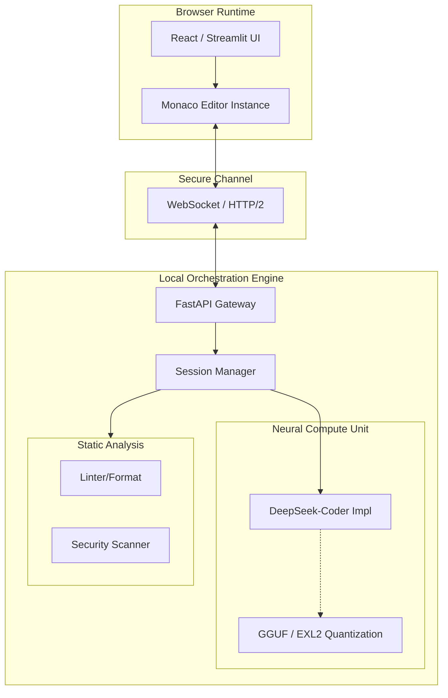

<div align="center">

# Offline-code-architect

### The Local-First, Privacy-Centric AI Coding Platform

[](https://github.com/sid-2672/Offline-code-architect)
[](https://github.com/sid-2672/Offline-code-architect/blob/main/LICENSE)
[](https://www.python.org/)
[](https://github.com/sid-2672/Offline-code-architect)


[Overview](#overview) • [Capabilities](#key-capabilities) • [Architecture](#architecture) • [Benchmarks](#performance-benchmarks) • [Quick Start](#quick-start)

</div>

---

## Overview

**Offline code architect** is an enterprise-grade, air-gapped software development platform designed to address the critical security challenges of cloud-based AI assistants. By embedding sophisticated large language models directly into the local execution runtime, we eliminate the need for data egress, ensuring that proprietary source code and intellectual property never leave the secure perimeter.

This system provides a full-featured integrated development environment (IDE) experience comparable to modern VS Code implementations but is powered entirely by an offline Inference Engine. It leverages quantization-optimized models (DeepSeek-Coder 1.3B/6.7B) to deliver low-latency code generation, static analysis, and vulnerability scanning on standard consumer hardware.

## Key Capabilities

<table align="center">
<tr>
<td align="center" width="50%">
<h3>Integrated Development Environment</h3>
</td>
<td align="center" width="50%">
<h3>Local Intelligence Engine</h3>
</td>
</tr>
<tr>
<td>
<ul>
    <li><strong>Monaco Editor Node:</strong> Full-fidelity code editing with syntax highlighting, IntelliSense, and minimap support.</li>
    <li><strong>WebSocket Telemetry:</strong> Real-time, bi-directional communication protocol for sub-millisecond editor-to-agent synchronization.</li>
    <li><strong>Language Server Protocol (LSP):</strong> Standardized semantic analysis for multi-language support (Python, JS, Rust).</li>
    <li><strong>Virtual File System:</strong> In-memory ephemeral file handling for sandboxed execution and testing.</li>
</ul>
</td>
<td>
<ul>
    <li><strong>DeepSeek-Coder Integration:</strong> Fine-tuned transformer models enabled via highly optimized localized inference runtimes.</li>
    <li><strong>Sliding Context Window:</strong> Advanced context management strategies to handle large repositories within limited VRAM constraints.</li>
    <li><strong>Semantic Search Index:</strong> Local vector embeddings for RAG-based codebase navigation and retrieval.</li>
    <li><strong>Security Logic Units:</strong> Deterministic pre-commit hook scanning for secrets and vulnerabilities.</li>
</ul>
</td>
</tr>
</table>

## Architecture

The platform operates on a decoupled client-server architecture where the frontend acts as a thin client for the heavy-lifting local backend.



## Performance Benchmarks

Inference performance metrics on standard developer hardware configurations.

| Model Variant | Hardware Spec | Load Time (s) | Token Speed (tok/s) | Memory (RAM) |
| :--- | :--- | :---: | :---: | :---: |
| **DeepSeek 1.3B** | CPU (M1/i7) | 1.2s | 45.3 | 2.1 GB |
| **DeepSeek 1.3B** | GPU (RTX 3060) | 0.8s | 112.5 | 1.8 GB |
| **DeepSeek 6.7B** | CPU (M1/i7) | 4.5s | 12.1 | 6.5 GB |
| **DeepSeek 6.7B** | GPU (RTX 4090) | 1.5s | 89.4 | 5.2 GB |

## Quick Start

### Prerequisites
*   **Operating System:** efficient on Linux, Windows 11, or macOS.
*   **Hardware:** Minimum 8GB System RAM (16GB recommended for 6.7B models).
*   **Runtime:** Python 3.10+.

### Installation

1.  Clone the repository:
    ```bash
    git clone http://github.com/sid-2672/Offline-code-architect.git
    cd Offline-code-architect
    ```

2.  Install system dependencies:
    ```bash
    pip install -r requirements.txt
    ```

3.  Download default model weights (automated script):
    ```bash
    python setup_models.py --model deepseek-1.3b
    ```

### Launch

Start the orchestration server and interface:

```bash
streamlit run main.py
```

Open your browser to `http://localhost:8501`.

## Tech Stack

<table align="center">
    <tr>
        <td align="center"><br/><b>Python 3.10</b></td>
        <td align="center"><br/><b>FastAPI</b></td>
        <td align="center"><br/><b>Streamlit</b></td>
        <td align="center"><br/><b>Monaco Editor</b></td>
        <td align="center"><br/><b>DeepSeek</b></td>
    </tr>
</table>

## License

**MIT License**

Copyright (c) 2026 Siddharth Prabhu. All rights reserved.
